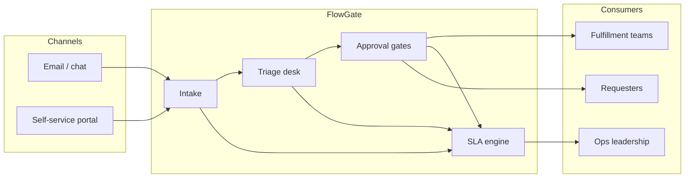

# FlowGate — Business Context

## Purpose

This document frames the business problem FlowGate addresses: inconsistent handling of internal service requests, opaque approval chains, and late discovery of SLA breaches.

## Problem statement

Northvale Shared Services (composite scenario) receives hundreds of IT and operations requests each month via email, chat, and ad-hoc forms. Requests vary in urgency, but intake is manual and approvals are tracked in spreadsheets. Operations leadership learns about SLA misses only after stakeholders escalate.

**Pain points:**

| Pain | Impact |
|------|--------|
| Fragmented intake | Duplicate work, lost context |
| Informal triage | Wrong priority assigned late |
| Unclear approval path | Requests stall between manager and director |
| Reactive SLA reporting | Breaches discovered after customer impact |

## Product vision

**FlowGate** is a workflow hub that standardizes:

1. **Intake** — structured service request capture  
2. **Triage** — ops analyst validates category, priority, routing  
3. **Multi-step approval** — manager then director for governed changes  
4. **SLA visibility** — On Track / At Risk / Breached for open work  

This repository is a **portfolio prototype** (`jah-guide`) proving requirements → working demo, not a production system.

## Scope

### In scope (demo)

- Create and list service requests with priority-based SLA clocks  
- Triage submitted requests and route to manager approval  
- Manager and director approve/reject with audit timeline  
- SLA posture badges on list and detail views  
- In-memory demo dataset with reset  

### Out of scope

- Enterprise SSO, RBAC, segregation of duties enforcement  
- Email/ITSM integrations (ServiceNow, Jira, etc.)  
- Persistent database, reporting warehouse, notifications  
- Production-grade security and data retention policies  

## Assumptions

- Priorities P1/P2/P3 map to 4h / 24h / 72h resolution targets from submission time.  
- “Resolution” for SLA measurement means **workflow completion** (approved or rejected), not full fulfillment.  
- Demo actors (Ops Analyst, Manager, Director) are selected implicitly by available actions on the detail page.  
- All timestamps use the application server clock (local demo).  

## Success measures (target operating model)

| Measure | Target |
|---------|--------|
| Intake structure | 100% requests captured with category + priority |
| Triage within SLA | P1 triaged within 30 minutes (process goal) |
| Approval transparency | Stakeholders see current gate and history |
| Breach visibility | Open breaches visible on ops dashboard without export |

## Context diagram

## References

- `03-requirements.md` — formal requirements  
- `05-process-as-is-to-be.md` — process transition  
- `09-acceptance-tests.md` — demo validation scenarios  
