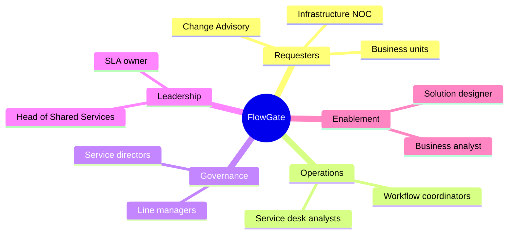

# FlowGate — Stakeholders & RACI

## Purpose

Identify who cares about service-request workflow outcomes and who performs each activity in the to-be process.

## Stakeholder map

## Stakeholder register

| Stakeholder | Interest | Influence | Key need |
|-------------|----------|-----------|----------|
| Business requester | Timely fulfillment | Medium | Status visibility, clear reject reasons |
| Ops analyst | Fair queue, accurate priority | High | Single queue, triage tools, SLA signals |
| Line manager | Risk control for team spend/access | High | Approve/reject with context |
| Service director | Policy alignment for high-impact work | High | Final gate for governed requests |
| Head of Shared Services | Throughput and breach rate | High | Dashboard of open SLA posture |
| Business analyst (portfolio) | Traceable specs → demo | Medium | Documented workflow for recruiters |

## RACI — to-be workflow

| Activity | Requester | Ops analyst | Line manager | Director | FlowGate system |
|----------|-----------|-------------|--------------|----------|-----------------|
| Submit request | **R** | I | I | I | **A** (records intake) |
| Validate completeness | C | **R/A** | I | I | C (required fields) |
| Assign priority/category | C | **R/A** | I | I | C (SLA clock) |
| Triage & route | I | **R/A** | I | I | **R** (state change) |
| Manager approval | I | C | **R/A** | I | **R** (audit trail) |
| Director approval | I | C | C | **R/A** | **R** (audit trail) |
| Monitor SLA posture | I | **R** | C | C | **A** (compute status) |
| Fulfillment execution | C | C | I | I | I (out of demo scope) |

**Legend:** R = Responsible, A = Accountable, C = Consulted, I = Informed  

## Communication plan (portfolio / pilot)

| Audience | Message | Channel | Frequency |
|----------|---------|---------|-----------|
| Requesters | How to submit and track | Portal help text | At launch |
| Ops desk | Triage SOP + SLA thresholds | Team briefing | Once + desk guide |
| Approvers | Approval SLA expectations | Email + detail links | Weekly until stable |
| Leadership | Breach trending | Dashboard review | Weekly |

## Demo role mapping

The Next.js prototype collapses real identities into demo labels:

| Real role | Demo label in UI |
|-----------|------------------|
| Ops analyst | Ops Analyst (demo) |
| Line manager | Line Manager (demo) |
| Director | Director (demo) |

Production would enforce role-based actions; the demo exposes actions on the detail page to keep the walkthrough frictionless.
