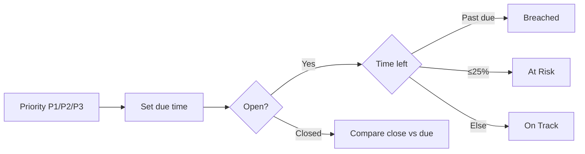

# FlowGate — Requirements

## Purpose

Functional and non-functional requirements for the service-request workflow prototype.

## Functional requirements

| ID | Requirement | Priority |
|----|-------------|----------|
| FR-01 | Capture request: title, description, category, priority, requester, department; start SLA | Must |
| FR-02 | List requests newest-first with status and SLA posture | Must |
| FR-03 | SLA due from priority (P1 4h, P2 24h, P3 72h) from `createdAt` | Must |
| FR-04 | Classify open SLA: On Track, At Risk (≤25% left), Breached | Must |
| FR-05 | Triage **Submitted** → route to manager (`pending_manager`) + timeline | Must |
| FR-06 | Manager approve/reject in **Manager approval** | Must |
| FR-07 | Director approve/reject in **Director approval** | Must |
| FR-08 | Append timeline events for create, triage, route, approve, reject | Must |
| FR-09 | Detail view: description, metadata, SLA panel, timeline | Must |
| FR-10 | Reset demo to seed data | Should |
| FR-11 | Rejection requires reason at approval steps | Should |
| FR-12 | Dashboard: open, awaiting approval, at risk, breached counts | Should |

## Non-functional requirements

| ID | Requirement | Target |
|----|-------------|--------|
| NFR-01 | Local run | `npm install` + `npm run dev` (Node 20+) |
| NFR-02 | No external deps | In-memory store, no auth keys |
| NFR-03 | Recruiter clarity | Grasp workflow in ~5 minutes |
| NFR-04 | Traceability | FR ↔ matrix ↔ acceptance tests |
| NFR-05 | Accessibility baseline | Labels, semantic headings |
| NFR-06 | Demo performance | List < 1s local |

## SLA business rules

## Workflow states

| State | Next transitions |
|-------|------------------|
| `submitted` | Triage → `pending_manager` |
| `pending_manager` | Approve → `pending_director`; reject → `rejected` |
| `pending_director` | Approve → `approved`; reject → `rejected` |
| `approved` / `rejected` | Terminal |

Triage is recorded on the timeline; status moves directly to `pending_manager` after triage in the demo.

## Categories (demo UI)

Access, Infrastructure, Integration, Hardware, Security, General

## Open questions (out of demo scope)

SLA pause while waiting on requester; director rules for low-cost P3; CMDB auto-categorization.
