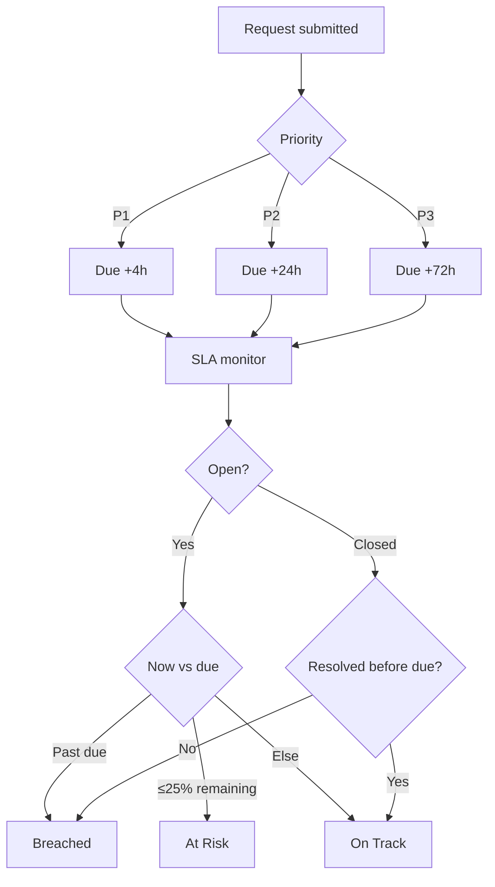

# FlowGate — Requirements

## Purpose

Functional and non-functional requirements for the FlowGate service-request workflow prototype.

## Functional requirements

| ID | Requirement | Priority | Notes |
|----|-------------|----------|-------|
| FR-01 | System shall capture a service request with title, description, category, priority, requester, department | Must | Starts SLA clock |
| FR-02 | System shall list requests newest-first with ID, status, SLA posture | Must | Ops queue view |
| FR-03 | System shall compute SLA due time from priority (P1 4h, P2 24h, P3 72h) | Must | From `createdAt` |
| FR-04 | System shall classify open SLA as On Track, At Risk (≤25% time left), or Breached | Must | See `src/lib/sla.ts` |
| FR-05 | Ops analyst shall triage **Submitted** requests and route to manager approval | Must | Adds timeline events |
| FR-06 | Manager shall approve/reject requests in **Manager approval** state | Must | Approve → director gate |
| FR-07 | Director shall approve/reject requests in **Director approval** state | Must | Approve → closed approved |
| FR-08 | System shall append immutable timeline events for create, triage, route, approve, reject | Must | Audit narrative |
| FR-09 | System shall show request detail with description, metadata, SLA panel, timeline | Must | Primary drill-in |
| FR-10 | User shall reset demo dataset to seed requests | Should | Footer action |
| FR-11 | Rejection shall require a reason note at approval steps | Should | Enforced in UI |
| FR-12 | Dashboard shall summarize open count, awaiting approval, at risk, breached | Should | Home page |

## Non-functional requirements

| ID | Requirement | Target | Verification |
|----|-------------|--------|--------------|
| NFR-01 | Local run path | `npm install` + `npm run dev` on Node 20+ | README |
| NFR-02 | No external services | No DB/auth/API keys | Architecture review |
| NFR-03 | Understandability | Recruiter grasps workflow in ≤5 minutes | Walkthrough |
| NFR-04 | Traceability | Each FR maps to tests in `08`/`09` | Matrix |
| NFR-05 | Accessibility baseline | Semantic headings, form labels | Manual check |
| NFR-06 | Performance (demo) | List page < 1s local | Smoke test |

## Business rules

## State machine (workflow)

| State | Meaning | Allowed transitions |
|-------|---------|---------------------|
| `submitted` | Intake complete, awaiting triage | → `pending_manager` via triage |
| `pending_manager` | Awaiting line manager | → `pending_director` approve; → `rejected` |
| `pending_director` | Awaiting director | → `approved`; → `rejected` |
| `approved` | Terminal — approved | — |
| `rejected` | Terminal — rejected | — |

> Note: `triaged` appears in analysis docs as an activity; the demo routes directly to `pending_manager` after triage while recording triage events on the timeline.

## Data categories (demo)

Access, Infrastructure, Integration, Hardware, Security, General

## Open questions (production follow-up)

1. Should SLA pause during “waiting for requester” states?  
2. Are director approvals required for all P3 hardware, or only cost threshold?  
3. Integration with CMDB for automatic categorization?  

Documented here for analyst traceability; out of demo scope.
