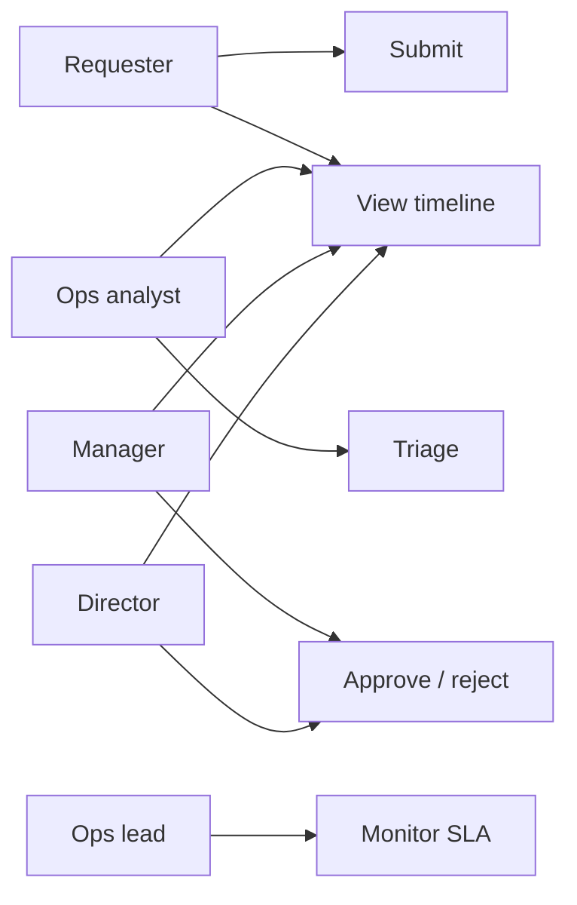

# FlowGate — Use Cases & User Stories

## Purpose

Key scenarios from each actor’s view, tied to demo behaviour and acceptance checks.

## Actors

| Actor | Role |
|-------|------|
| Requester | Submits work |
| Ops analyst | Triage and route |
| Manager / Director | Approve or reject |
| Ops lead | Reads SLA posture on dashboard |

## UC-01 Submit service request

**Actor:** Requester · **Trigger:** **New request**

1. Enter title, description, category, priority, requester, department.  
2. System validates, assigns ID, sets `submitted`, starts SLA, logs `created`.  
3. User lands on detail page.

**Acceptance:** SLA due matches priority; status **Submitted**; timeline shows submission.

---

## UC-02 Triage and route

**Actor:** Ops analyst · **Pre:** `submitted`

1. Optional triage note → system logs triage + route → `pending_manager`.

**Acceptance:** Timeline shows triage and manager routing; manager panel visible.

---

## UC-03 Multi-step approval

**Actors:** Manager, then Director

1. Manager approve → `pending_director`.  
2. Director approve → `approved`.

**Acceptance:** Director cannot act before manager; closed requests hide actions.

---

## UC-04 Reject with reason

**Actor:** Manager or Director

1. Required rejection reason → `rejected` + timeline event.

**Acceptance:** Reason on timeline; SLA panel remains for review.

---

## UC-05 Monitor SLA posture

**Actor:** Ops lead · **Trigger:** Home or requests list

**Acceptance:** Dashboard counts (open, awaiting approval, at risk, breached); row badges; SR-0975 shows **Breached**.

## User stories (delivered slice)

| ID | I want… | So that… | FR |
|----|---------|----------|-----|
| S-01 | structured intake | ops has one format | FR-01 |
| S-02 | a recency-sorted queue | I can triage | FR-02 |
| S-03 | SLA badges | I spot risk early | FR-04 |
| S-04 | triage on detail | context stays together | FR-05 |
| S-05 | approve/reject with notes | audit is clear | FR-06, FR-08 |
| S-06 | director final gate | policy holds | FR-07 |
| S-07 | dashboard counts | leadership sees trends | FR-12 |
| S-08 | reset seed data | demos replay cleanly | FR-10 |
