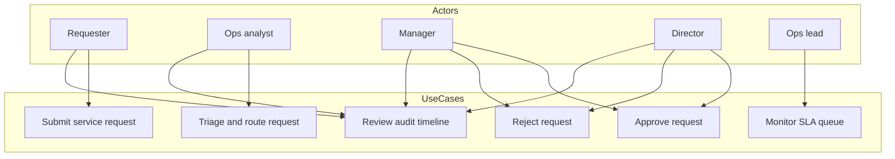

# FlowGate — Use Cases & User Stories

## Purpose

Describe interactive scenarios from the actor’s perspective, with acceptance criteria aligned to the demo application.

## Actors

- **Requester** — submits work  
- **Ops analyst** — triages and routes  
- **Approver (manager/director)** — governance decisions  
- **Ops lead** — monitors SLA posture (dashboard reader)  

## Use case diagram

## UC-01 Submit service request

**Primary actor:** Requester  
**Precondition:** Demo app running  
**Trigger:** User selects **New request**

**Main flow:**

1. Requester enters title, description, category, priority, requester, department.  
2. System validates required fields.  
3. System assigns ID, sets status `submitted`, starts SLA clock, records `created` timeline event.  
4. System navigates to detail page.

**Postcondition:** Request appears on list with SLA badge.

**Acceptance criteria:**

- SLA due reflects priority (P1/P2/P3).  
- Status shows **Submitted**.  
- Timeline contains “Request submitted”.

---

## UC-02 Triage and route

**Primary actor:** Ops analyst  
**Precondition:** Request in `submitted`  
**Trigger:** Analyst completes triage form on detail page

**Main flow:**

1. Analyst adds optional triage note.  
2. System records triage + route events.  
3. Status becomes `pending_manager`.

**Alternate:** Invalid state shows no triage panel (closed or already routed).

**Acceptance criteria:**

- Timeline shows triage and “Routed to line manager approval”.  
- Manager approval panel visible.

---

## UC-03 Multi-step approval

**Primary actor:** Manager, then Director  
**Precondition:** Request at respective gate  

**Main flow (happy path):**

1. Manager approves → status `pending_director`.  
2. Director approves → status `approved`.  
3. Timeline captures both approvals.

**Acceptance criteria:**

- Cannot director-approve before manager step.  
- Closed requests hide action panels.

---

## UC-04 Reject with reason

**Primary actor:** Manager or Director  
**Main flow:**

1. Approver enters rejection reason (required).  
2. System sets `rejected`, appends rejection event.

**Acceptance criteria:**

- Reason stored on timeline note.  
- SLA panel still visible for post-mortem.

---

## UC-05 Monitor SLA posture

**Primary actor:** Ops lead  
**Trigger:** Opens home or requests list

**Acceptance criteria:**

- Counts for open, awaiting approval, at risk, breached on dashboard.  
- Each row shows On Track / At Risk / Breached badge.  
- SR-0975 seed demonstrates breached submitted work.

## User stories (backlog slice delivered)

| Story | As a… | I want… | So that… | FR |
|-------|-------|---------|----------|-----|
| S-01 | requester | to log a structured request | ops has consistent intake | FR-01 |
| S-02 | ops analyst | a single queue sorted by recency | I can plan triage | FR-02 |
| S-03 | ops analyst | SLA badges | I prioritize at-risk work | FR-04 |
| S-04 | ops analyst | to triage from the detail page | context stays in one place | FR-05 |
| S-05 | manager | approve or reject with notes | governance is auditable | FR-06, FR-08 |
| S-06 | director | final approval | policy holds for high impact | FR-07 |
| S-07 | ops lead | dashboard counts | I see breach trend early | FR-12 |
| S-08 | demo visitor | reset seed data | I can replay scenarios | FR-10 |
