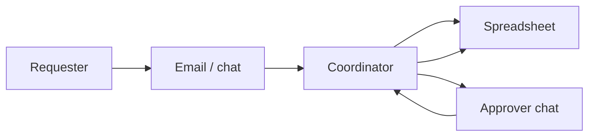
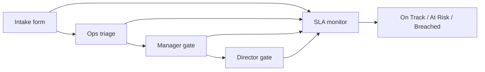

# FlowGate — Process (As-Is → To-Be)

## Purpose

Show how informal intake today becomes a governed FlowGate workflow in the demo.

## As-is (today)

Requests land in email and chat. A coordinator re-types details into a spreadsheet, chases approvals verbally, and updates status late. SLA is reviewed from monthly exports.

**Pain points:** no single queue, weak audit trail, SLA found after the fact.

## To-be (FlowGate demo)

Structured intake → ops triage → manager → director, with SLA posture visible throughout.

## Change at a glance

| Step | As-is | To-be |
|------|-------|-------|
| Capture | Unstructured threads | Structured form |
| Prioritize | Ad hoc | Analyst + P1–P3 policy |
| Approve | Chat | Sequential gates + timeline |
| Report | Monthly export | Live dashboard + badges |

## Triage SOP (excerpt)

1. Match category to work type.  
2. Confirm priority against impact/urgency.  
3. Add routing note → submit triage → routes to manager approval.

## Approval policy (demo)

All priorities use manager then director in the prototype; production would vary by category and cost.

## Metrics in the demo

| Metric | Where |
|--------|--------|
| Open queue | Home stats |
| Approval aging | Timeline timestamps |
| Breach rate | Home + list SLA badges |
| First-touch triage | Created → triage event |

## Known gaps (production)

| Gap | Demo | Next step |
|-----|------|-----------|
| Auth | Implicit roles | SSO + RBAC |
| Notifications | Manual refresh | Email/Teams |
| Post-approval fulfillment | Out of scope | ITSM integration |
