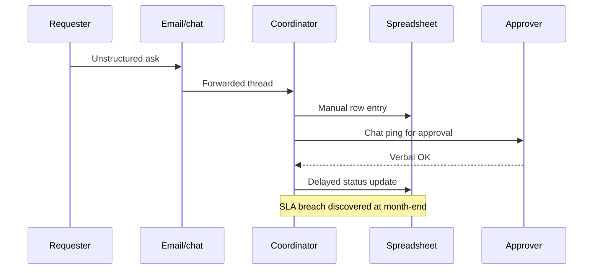
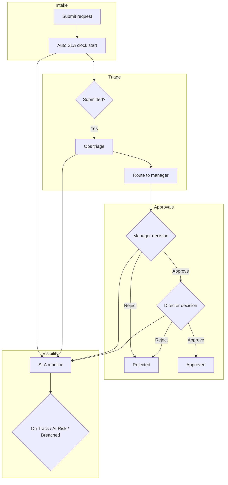

# FlowGate — Process (As-Is → To-Be)

## Purpose

Contrast today's informal request handling with the standardized FlowGate workflow implemented in the demo.

## As-is process (summary)

Requests arrive through multiple channels. An ops coordinator manually copies details into a spreadsheet, pings approvers on chat, and updates status inconsistently. SLA is measured monthly from exported ticket dumps.

### As-is swimlane

**As-is weaknesses:** no single queue, weak audit trail, approvals not linked to SLA clock, breach detection lagging.

## To-be process (target)

All intake enters FlowGate. Ops analyst triages within priority guidelines, system routes to manager then director. SLA engine continuously classifies open requests.

### To-be swimlane

## Process change narrative

| Step | As-is | To-be | Benefit |
|------|-------|-------|---------|
| Capture | Email text | Structured form | Searchable, complete |
| Prioritize | Ad hoc | Analyst + policy P1–P3 | Predictable SLA |
| Approve | Chat | Sequential gates in system | Audit + routing |
| Report | Monthly export | Live badges + dashboard | Early intervention |

## Triage standard operating procedure (excerpt)

1. Confirm category matches work type (access, infra, etc.).  
2. Validate priority against impact/urgency grid.  
3. Document routing note (dependencies, CAB linkage).  
4. Submit triage → system moves to manager approval.

## Approval policy (demo simplification)

| Priority | Manager | Director |
|----------|---------|----------|
| P1 | Required | Required |
| P2 | Required | Required |
| P3 | Required | Required |

Production would tailor gates by category (e.g., Security always director).

## Process metrics

| Metric | Definition | Source in demo |
|--------|------------|----------------|
| Open queue | Not approved/rejected | Dashboard |
| Approval aging | Time in pending_* | Timeline timestamps |
| SLA breach rate | Open breached / open total | Home stats |
| First-touch triage | Created → triage event delta | Timeline |

## Gap list (as-is → demo)

| Gap | Mitigation in demo | Production follow-up |
|-----|-------------------|----------------------|
| No auth | Demo roles implicit | SSO + RBAC |
| No notifications | Manual refresh | Email/Teams hooks |
| Fulfillment after approval | Out of scope | ITSM integration |
