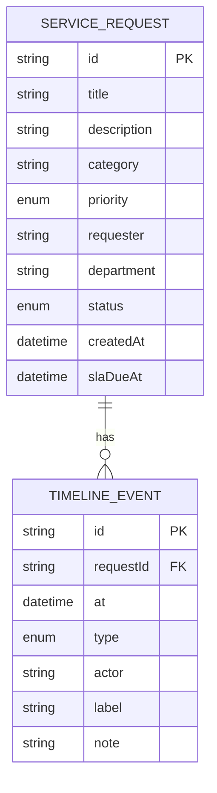
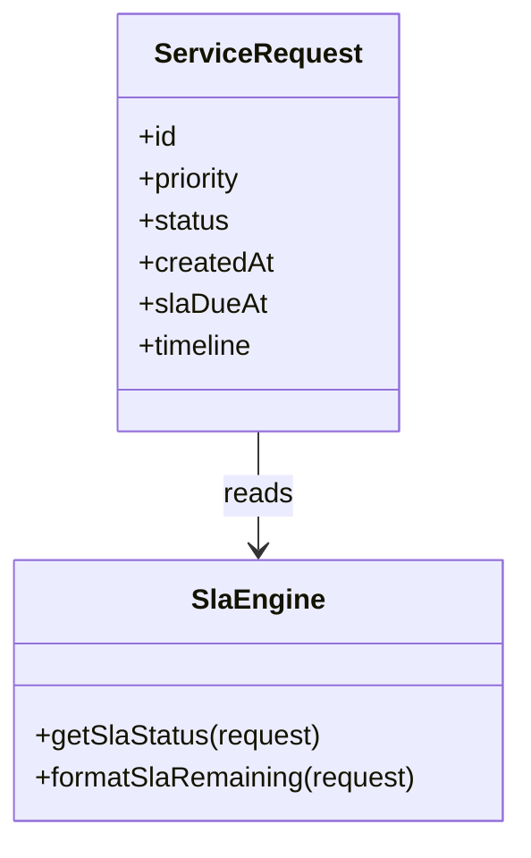

# FlowGate — Data Model

## Purpose

Conceptual and logical data structures for service requests, timeline audit events, and SLA derivations.

## Conceptual model

## Logical schema (demo implementation)

Implemented in TypeScript types (`src/lib/types.ts`) with an in-memory collection (`src/lib/store.ts`).

### `ServiceRequest`

| Field | Type | Rules |
|-------|------|-------|
| `id` | string | Format `SR-{n}`, unique |
| `title` | string | 1–120 chars |
| `description` | string | Required |
| `category` | string | Controlled list in UI |
| `priority` | `P1` \| `P2` \| `P3` | Drives SLA hours |
| `requester` | string | Display name |
| `department` | string | Owning unit |
| `status` | enum | Workflow state |
| `createdAt` | ISO datetime | Set at create |
| `slaDueAt` | ISO datetime | `createdAt + SLA_HOURS[priority]` |
| `timeline` | TimelineEvent[] | Ordered audit log |

### `TimelineEvent`

| Field | Type | Rules |
|-------|------|-------|
| `id` | string | Unique per event |
| `at` | ISO datetime | Event timestamp |
| `type` | enum | `created`, `triaged`, `routed`, `approved`, `rejected`, `comment` |
| `actor` | string | Human or System |
| `label` | string | Short summary shown in UI |
| `note` | string? | Optional detail |

## SLA derivation (non-persisted)

`SlaStatus` is calculated at read time:

| Value | Rule (open request) |
|-------|---------------------|
| `breached` | `now >= slaDueAt` |
| `at_risk` | remaining time ≤ 25% of total window |
| `on_track` | otherwise |

Closed requests compare last timeline timestamp to `slaDueAt`.

## Seed data

`src/lib/seed.ts` provides six representative requests covering:

- Manager and director gates in flight  
- Approved and rejected terminals  
- Breached submitted work (SR-0975)  

## Production persistence notes

For a real deployment, map to relational tables:

- `service_requests` (header)  
- `timeline_events` (append-only, FK to request)  
- Optional `attachments`, `approver_delegations`, `sla_pauses`  

Indexes: `(status, created_at)`, `(sla_due_at)` for breach sweeps.

## Data dictionary — priority SLA

| Priority | SLA hours | Typical use |
|----------|-----------|-------------|
| P1 | 4 | Security/access/incident blocking work |
| P2 | 24 | Significant but workaround exists |
| P3 | 72 | Standard fulfillment / projects |
