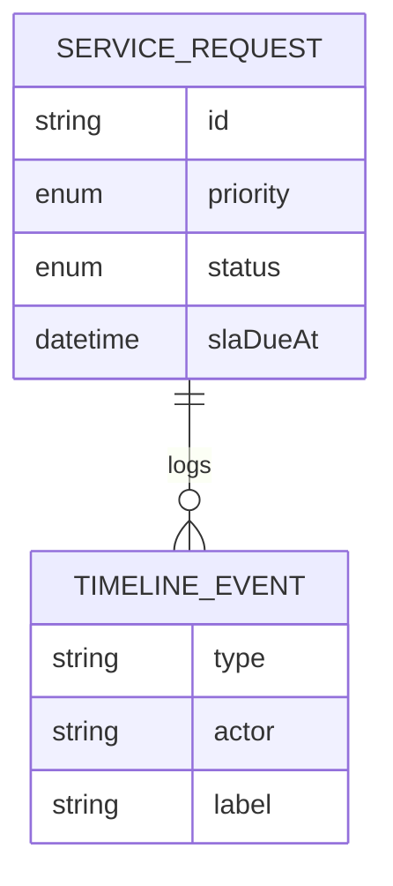

# FlowGate — Data Model

## Purpose

Core entities for service requests, audit timeline, and SLA posture (computed at read time).

## Entity relationship

## Implementation

Types in `src/lib/types.ts`; in-memory collection in `src/lib/store.ts`.

### ServiceRequest (header)

| Field | Notes |
|-------|--------|
| `id` | `SR-{n}`, unique |
| `title`, `description` | Required intake |
| `category`, `priority`, `requester`, `department` | Intake metadata |
| `status` | Workflow enum |
| `createdAt`, `slaDueAt` | Clock start + due |
| `timeline` | Ordered events |

### TimelineEvent (audit)

| Field | Notes |
|-------|--------|
| `type` | `created`, `triaged`, `routed`, `approved`, `rejected`, `comment` |
| `actor`, `label`, `note?` | Who did what |

## SLA posture (derived)

| Value | Open request rule |
|-------|-------------------|
| `breached` | Now ≥ `slaDueAt` |
| `at_risk` | ≤25% of window remaining |
| `on_track` | Otherwise |

Closed requests compare last timeline time to due date. Logic: `src/lib/sla.ts`.

## Seed data

`src/lib/seed.ts` — six tickets covering both approval gates, terminals, and breached submitted work (SR-0975).

## Production notes

Relational mapping: `service_requests` + append-only `timeline_events`. Index `(status, created_at)` and `(sla_due_at)` for breach sweeps.

## Priority → SLA hours

| Priority | Hours | Typical use |
|----------|-------|-------------|
| P1 | 4 | Blocking / security |
| P2 | 24 | Significant, workaround exists |
| P3 | 72 | Standard / project work |
