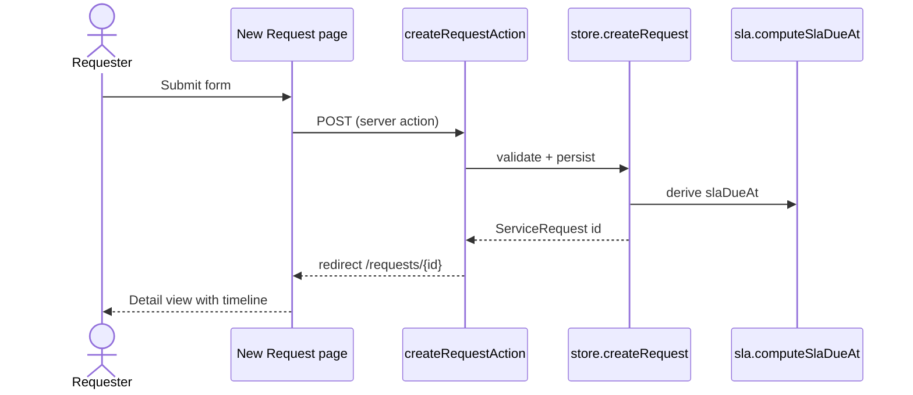
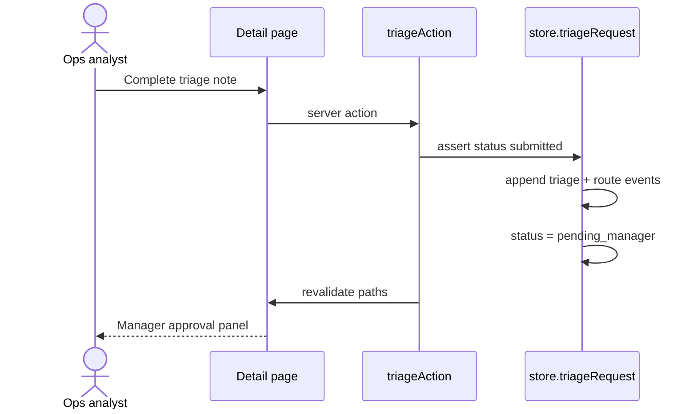
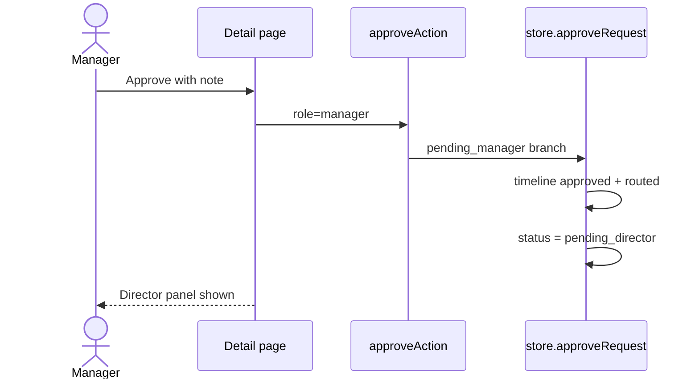
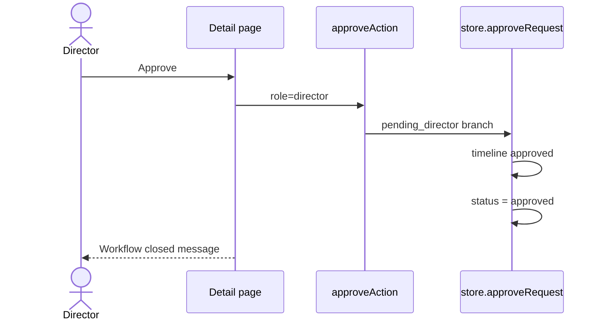
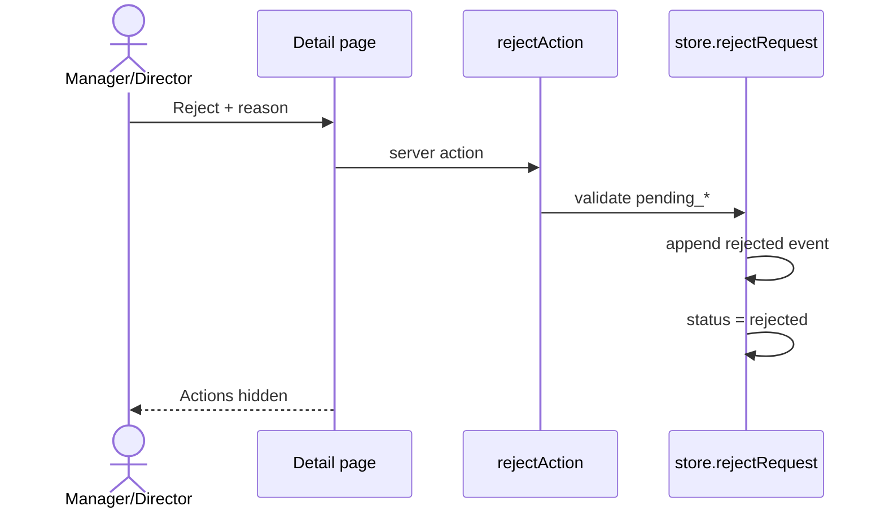
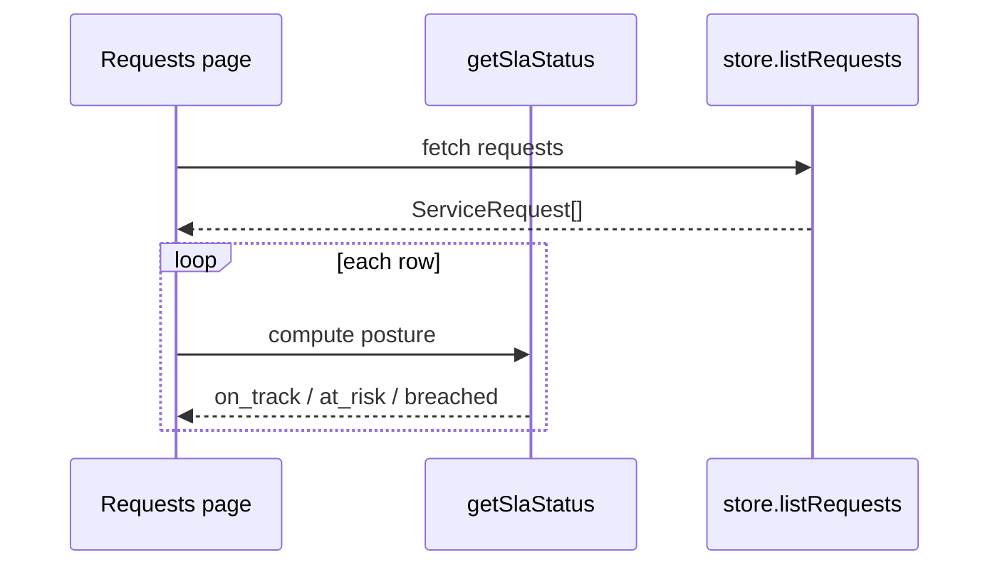
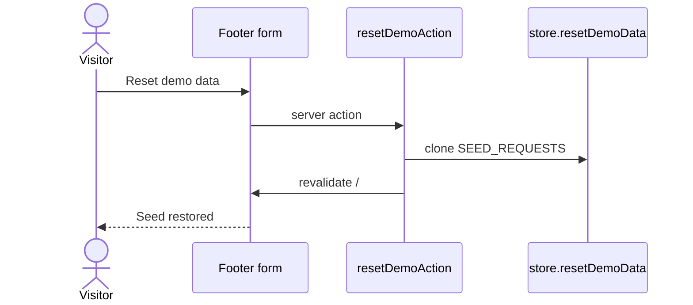

# FlowGate — Sequence Flows

## Purpose

Illustrate runtime interactions between user, Next.js UI, server actions, and the in-memory store.

## Create request

## Triage and route

## Manager approve → director gate

## Director approve (close happy path)

## Reject path

## SLA read path (list/detail)

## Reset demo data

