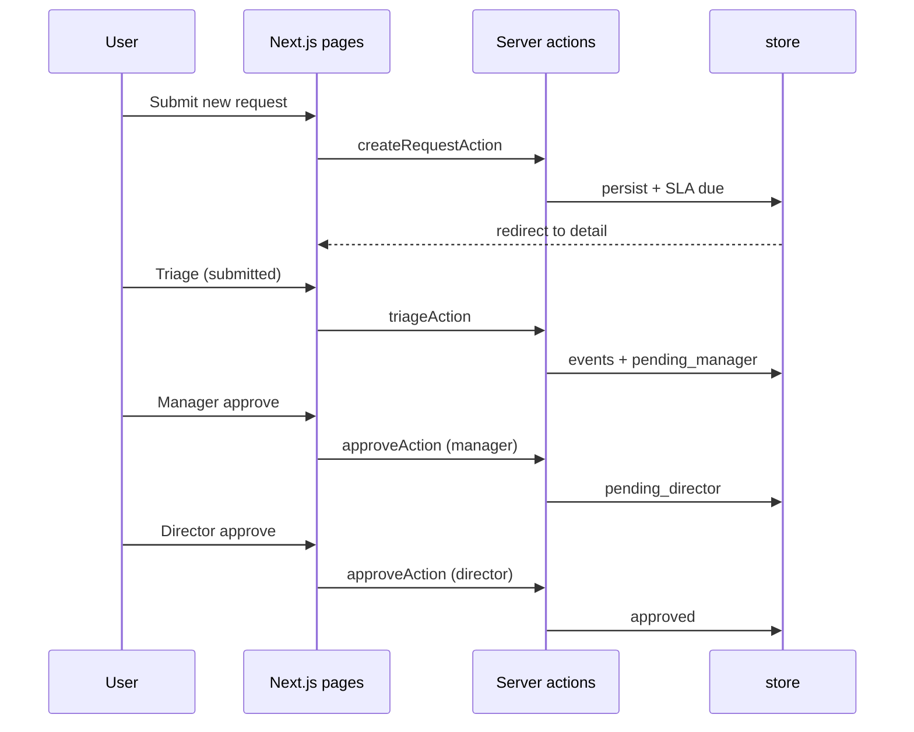
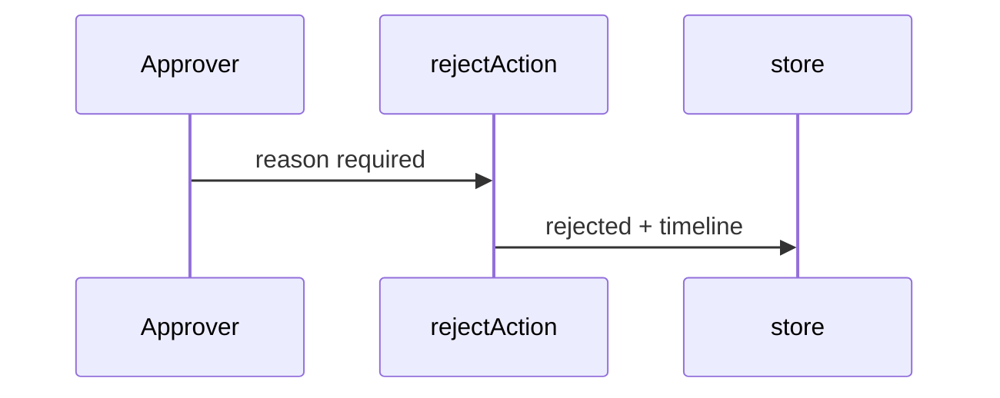
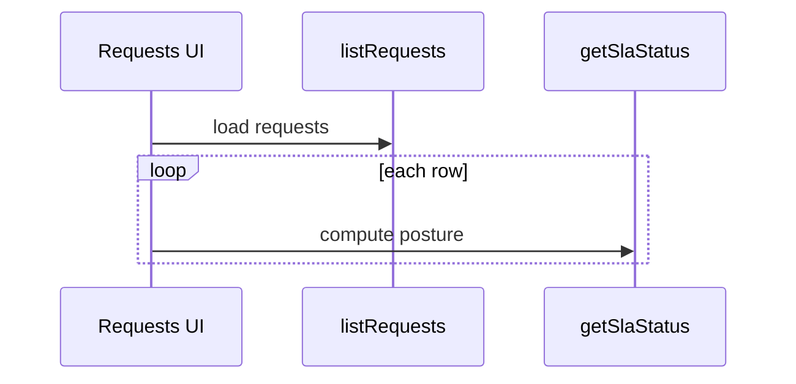

# FlowGate — Sequence Flows

## Purpose

How the UI, server actions, and in-memory store interact at runtime.

## Intake → triage → approval

## Reject path

## SLA on list / detail

## Reset demo

Visitor uses footer **Reset demo data** → `resetDemoAction` → `store.resetDemoData()` → seed restored.
