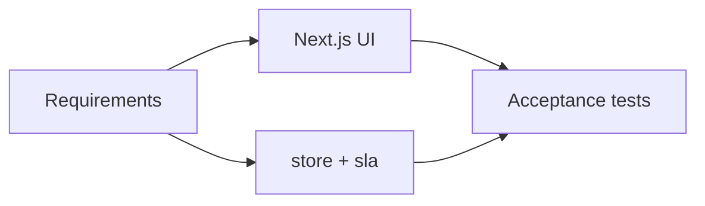

# FlowGate — Traceability Matrix

## Purpose

Link requirements to design, code, and acceptance tests.

## FR → build → test

| Req | Summary | Code / UI | Test |
|-----|---------|-----------|------|
| FR-01 | Capture request | `createRequestAction`, `/requests/new` | AT-01 |
| FR-02 | List queue | `RequestTable`, `listRequests` | AT-02 |
| FR-03 | SLA due hours | `sla.ts`, `SLA_HOURS` | AT-03 |
| FR-04 | SLA badges | `SlaBadge`, `SlaDetail`, home stats | AT-04, AT-09 |
| FR-05 | Triage | `triageRequest`, `RequestActions` | AT-05 |
| FR-06 | Manager gate | `approveRequest` / `rejectRequest` | AT-06, AT-07 |
| FR-07 | Director gate | `approveRequest` (director) | AT-08 |
| FR-08 | Timeline | `Timeline`, store append | AT-05–AT-08 |
| FR-09 | Detail page | `/requests/[id]` | AT-02 |
| FR-10 | Reset demo | `resetDemoAction` | AT-10 |
| FR-11 | Reject reason | reject form `required` | AT-07 |
| FR-12 | Dashboard | `src/app/page.tsx` | AT-04 |

## Stories → routes

| Story | FR | Route |
|-------|-----|-------|
| S-01 | FR-01 | `/requests/new` |
| S-02 | FR-02 | `/requests` |
| S-03 | FR-04 | list badges |
| S-04 | FR-05 | detail triage |
| S-05–S-06 | FR-06–07 | detail approve |
| S-07 | FR-12 | `/` |
| S-08 | FR-10 | footer reset |

## NFR evidence

| NFR | Evidence |
|-----|----------|
| NFR-01 | README run steps |
| NFR-02 | No `.env`; in-memory store |
| NFR-03 | README + simplified docs pack |
| NFR-04 | This matrix + `09-acceptance-tests.md` |
| NFR-05 | Form labels, headings |
| NFR-06 | `npm run build` smoke |

## Analysis → implementation

## Intentional gaps

Fulfillment after approval, RBAC, and persistent DB are out of portfolio scope.
