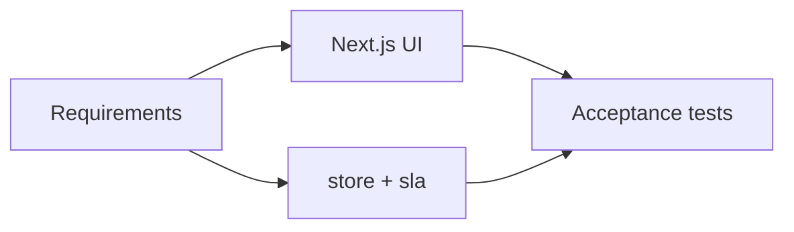

# FlowGate — Traceability Matrix

## Purpose

Link requirements to design, code, and acceptance tests.

## FR → build → test

| Req | Summary | Code / UI | Test |
|-----|---------|-----------|------|
| FR-01 | Capture request | `createRequestAction`, `/requests/new` | AT-01 |
| FR-02 | List queue | `RequestTable`, `listRequests` | AT-02 |
| FR-03 | SLA due hours | `sla.ts`, `SLA_HOURS` | AT-03 |
| FR-04 | SLA badges | `SlaBadge`, `SlaDetail`, home stats | AT-04, AT-09 |
| FR-05 | Triage | `triageRequest`, `RequestActions` | AT-05 |
| FR-06 | Manager gate | `approveRequest` / `rejectRequest` | AT-06, AT-07 |
| FR-07 | Director gate | `approveRequest` (director) | AT-08 |
| FR-08 | Timeline | `Timeline`, store append | AT-05–AT-08 |
| FR-09 | Detail page | `/requests/[id]` | AT-02 |
| FR-10 | Reset demo | `resetDemoAction` | AT-10 |
| FR-11 | Reject reason | reject form `required` | AT-07 |
| FR-12 | Dashboard | `src/app/page.tsx` | AT-04 |
| FR-13 | Queue search | `queue-filters.ts`, `RequestQueue` | AT-11 |
| FR-14 | Queue filters | `RequestQueue` | AT-11 |
| FR-15 | CSV export | `export-csv.ts` | AT-12 |
| FR-16 | SLA countdown | `SlaCountdown`, `RequestTable` | AT-13 |
| FR-17 | Confirm dialogs | `RequestWorkflowPanel`, `ResetDemoButton` | AT-14 |
| FR-18 | Keyboard shortcuts | `RequestWorkflowPanel` | AT-14 |
| FR-19 | Activity feed | `ActivityFeed`, `activity.ts` | AT-15 |
| FR-20 | UI preferences | `preferences.tsx`, `PreferenceToggle` | AT-15 |
| FR-21 | Queue presets | `QUEUE_PRESETS`, `RequestQueue` | AT-16 |
| FR-22 | URL filters | `filtersToSearchParams` | AT-16 |
| FR-23 | SLA sort | `sortRequests` | AT-16 |
| FR-24 | SLA progress | `SlaProgressBar` | AT-17 |
| FR-25 | Copy actions | `CopyButton`, detail header | AT-17 |
| FR-26 | Intake draft | `NewRequestForm` | AT-18 |
| FR-27 | Attention badge | `NavLinks`, `countAttentionRequests` | AT-18 |

## Stories → routes

| Story | FR | Route |
|-------|-----|-------|
| S-01 | FR-01 | `/requests/new` |
| S-02 | FR-02 | `/requests` |
| S-03 | FR-04 | list badges |
| S-04 | FR-05 | detail triage |
| S-05–S-06 | FR-06–07 | detail approve |
| S-07 | FR-12 | `/` |
| S-08 | FR-10 | footer reset |
| S-09–S-10 | FR-13–15 | `/requests` |
| S-11 | FR-16 | list + detail SLA |
| S-12 | FR-19 | `/` activity |
| S-13 | FR-20 | topbar prefs |

## NFR evidence

| NFR | Evidence |
|-----|----------|
| NFR-01 | README run steps |
| NFR-02 | No `.env`; in-memory store |
| NFR-03 | README + simplified docs pack |
| NFR-04 | This matrix + `09-acceptance-tests.md` |
| NFR-05 | Form labels, headings |
| NFR-06 | `npm run build` smoke |

## Analysis → implementation

## Intentional gaps

Fulfillment after approval, RBAC, and persistent DB are out of portfolio scope.
