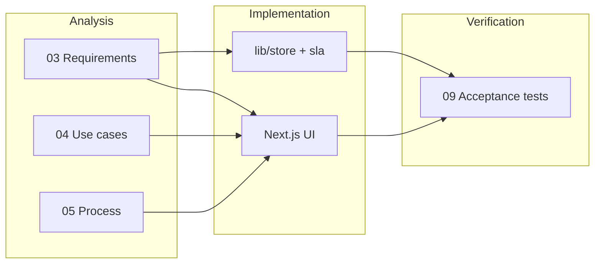

# FlowGate — Traceability Matrix

## Purpose

Map requirements to design artifacts, implementation anchors, and acceptance tests.

## Requirements → design → build → test

| Req ID | Requirement summary | Process / UX | Data / logic | Code reference | Test ID |
|--------|---------------------|--------------|--------------|----------------|---------|
| FR-01 | Capture service request | UC-01, `/requests/new` | `ServiceRequest` | `store.createRequest`, `createRequestAction` | AT-01 |
| FR-02 | List requests | UC-05, `/requests` | sorted collection | `RequestTable`, `listRequests` | AT-02 |
| FR-03 | SLA due by priority | BR diagram | `SLA_HOURS`, `computeSlaDueAt` | `src/lib/sla.ts`, `types.ts` | AT-03 |
| FR-04 | SLA posture badges | Dashboard + list | `getSlaStatus` | `SlaBadge`, `SlaDetail` | AT-04, AT-09 |
| FR-05 | Triage submitted | UC-02 | status transition | `triageRequest`, `RequestActions` | AT-05 |
| FR-06 | Manager approve/reject | UC-03, UC-04 | pending_manager | `approveRequest`, `rejectRequest` | AT-06, AT-07 |
| FR-07 | Director approve/reject | UC-03 | pending_director | `approveRequest` (director branch) | AT-08 |
| FR-08 | Timeline audit | All UCs | `TimelineEvent[]` | `Timeline`, store append helpers | AT-05–AT-08 |
| FR-09 | Detail view | UC-06 | composite | `/requests/[id]/page.tsx` | AT-02 |
| FR-10 | Reset demo | — | seed clone | `resetDemoAction` | AT-10 |
| FR-11 | Rejection reason required | UC-04 | note on event | reject form `required` | AT-07 |
| FR-12 | Dashboard metrics | UC-05 | counts + SLA | `src/app/page.tsx` | AT-04 |

## User story traceability

| Story | FR IDs | Doc sections | Demo route |
|-------|--------|--------------|------------|
| S-01 | FR-01 | 04 UC-01 | `/requests/new` |
| S-02 | FR-02 | 04 UC-05 | `/requests` |
| S-03 | FR-04 | 03 business rules | list badges |
| S-04 | FR-05 | 05 triage SOP | detail triage panel |
| S-05 | FR-06, FR-08 | 07 manager seq | detail approve |
| S-06 | FR-07 | 07 director seq | detail approve |
| S-07 | FR-12 | 01 success measures | `/` |
| S-08 | FR-10 | — | footer reset |

## NFR traceability

| NFR | Evidence |
|-----|----------|
| NFR-01 | README run section |
| NFR-02 | No `.env` required; in-memory store |
| NFR-03 | README problem statement + docs index |
| NFR-04 | This matrix + `09-acceptance-tests.md` |
| NFR-05 | labeled forms, semantic headings |
| NFR-06 | local smoke (`npm run build`) |

## Coverage diagram

## Known intentional gaps

| Item | Reason |
|------|--------|
| Fulfillment after approval | Out of portfolio scope |
| Role-based security | Demo simplification |
| Persistent DB | Local prototype only |
